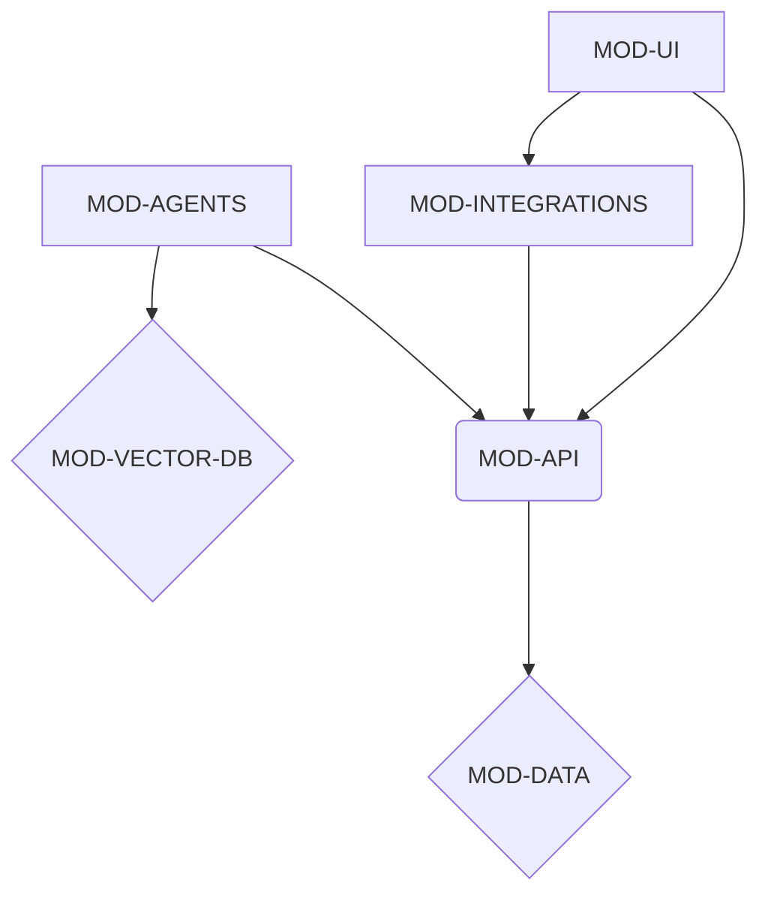

# HarmonyCare Dependency Graph

**DOCUMENT:** dependency_graph.md
**OUTPUT PATH:** docs/ssot/dependency_graph.md

---

## 1. Module Dependencies

This section outlines the dependencies between the core modules of the HarmonyCare platform. The architecture is designed to be modular, but clear dependencies exist for data flow and functionality.

| Dependent Module | Dependency On | Description of Dependency |
|---|---|---|
| **MOD-UI** | **MOD-API** | The React frontend consumes data and triggers actions exclusively through the tRPC API. All user interactions that require data persistence or business logic are routed through the API. |
| **MOD-API** | **MOD-DATA** | The tRPC API layer is responsible for all database interactions. It uses the Drizzle ORM to query and mutate data in the MySQL/TiDB database. |
| **MOD-AGENTS** | **MOD-API** | AI agents, orchestrated by LangGraph and CrewAI, interact with the platform's data and services via the API. This ensures that agent actions are governed by the same business logic and access controls as the UI. |
| **MOD-AGENTS** | **MOD-DATA** | Agents have direct read access to the Vector DB for their memory and knowledge base. Write operations are funneled through the API. |
| **MOD-INTEGRATIONS** | **MOD-API** | External services like Resend (email), S3 (storage), and OAuth are integrated at the API level. The frontend and agents do not interact with these services directly. |
| **MOD-UI** | **MOD-INTEGRATIONS** | The UI indirectly depends on integrations. For example, file uploads are handled by the UI, but the file is sent to the API, which then uses the S3 integration. |

### Mermaid Diagram: Module Dependencies

## 2. Task Chains & Critical Path

The following table breaks down the high-level task chains based on the project's phased rollout. The critical path is identified as the sequence of tasks that directly impacts the project's completion time.

| Phase | Task ID | Task Description | Dependencies | Critical Path? |
|---|---|---|---|---|
| **Phase 1: Foundation** | TASK-CORE-0001 | Setup Database Schema (MOD-DATA) | - | **Yes** |
| | TASK-CORE-0002 | Implement User Auth (MOD-API, MOD-UI) | TASK-CORE-0001 | **Yes** |
| | TASK-CORE-0003 | Basic Admin Dashboard (MOD-UI) | TASK-CORE-0002 | No |
| **Phase 2: Product Pages** | TASK-FEAT-0001 | Build AI Agents Showcase Page (MOD-UI) | TASK-CORE-0002 | No |
| | TASK-FEAT-0002 | Develop Features Page (MOD-UI) | TASK-CORE-0002 | No |
| | TASK-FEAT-0003 | Create Dashboards Page (MOD-UI) | TASK-CORE-0003 | No |
| **Phase 3: Solutions & Pricing** | TASK-SOL-0001 | Implement Group Homes Page (MOD-UI) | TASK-CORE-0002 | No |
| | TASK-SOL-0002 | Implement ICF-ID Page (MOD-UI) | TASK-CORE-0002 | No |
| | TASK-PRICE-0001 | Build Pricing Page (MOD-UI) | TASK-CORE-0002 | No |
| **Phase 4: Company & Forms** | TASK-COMP-0001 | Create About Page (MOD-UI) | TASK-CORE-0002 | No |
| | TASK-FORM-0001 | Implement Demo Request Form (MOD-UI, MOD-API) | TASK-CORE-0002 | **Yes** |

### Critical Path Summary

The critical path for the initial launch of the HarmonyCare platform involves the core functionalities that enable user interaction and data capture:

1.  **TASK-CORE-0001: Setup Database Schema** - The foundation of the entire application.
2.  **TASK-CORE-0002: Implement User Auth** - Essential for securing the platform and personalizing the user experience.
3.  **TASK-FORM-0001: Implement Demo Request Form** - A key business goal for lead generation.

## 3. Parallel Opportunities

Given the modular architecture, several development tracks can be pursued in parallel after the foundational tasks are complete.

| Parallel Track | Tasks | Description |
|---|---|---|
| **UI Development (Content Pages)** | TASK-FEAT-0001, TASK-FEAT-0002, TASK-SOL-0001, TASK-SOL-0002, TASK-PRICE-0001, TASK-COMP-0001 | Once the basic UI shell and authentication are in place, all content-heavy pages can be developed concurrently. These pages have minimal backend dependencies beyond fetching static or semi-static content. |
| **API & Backend Development** | TASK-API-*, TASK-AGENT-* | Development of specific API endpoints and the underlying business logic for various features can proceed in parallel with frontend development. This includes work on the AI agents and their required tools. |
| **Admin Features** | TASK-CORE-0003, TASK-ADMIN-* | The admin dashboard and its related features can be developed as a separate track, as they are not on the critical path for the public-facing launch. |

## 4. Freeze Gates

Freeze gates are established to ensure stability and quality at critical project milestones. These gates represent points at which changes to certain parts of the codebase are restricted.

| Gate ID | Gate Name | Trigger | Scope of Freeze | Exit Criteria |
|---|---|---|---|---|
| **GATE-DB-SCHEMA** | Database Schema Freeze | After Phase 1 (Foundation) is complete and signed off. | **MOD-DATA**: No further breaking changes to the database schema without a formal review and migration plan. | All Phase 1 features are stable and tested against the schema. |
| **GATE-API-CORE** | Core API Freeze | Before the start of Phase 2 (Product Pages). | **MOD-API**: Core authentication and user management endpoints are frozen. New endpoints can be added, but existing ones cannot be changed in a breaking way. | Core API endpoints are fully documented and tested. |
| **GATE-UI-KIT** | UI Kit & Component Freeze | Mid-way through Phase 2. | **MOD-UI**: Core UI components (shadcn/ui extensions, layout components) are finalized. | All core components are documented in a storybook or style guide. |
| **GATE-PRE-LAUNCH** | Pre-Launch Feature Freeze | Two weeks before the planned launch date. | All modules (**MOD-UI, MOD-API, MOD-AGENTS**): No new features are to be added. Only bug fixes are permitted. | All critical bugs are resolved, and the platform has passed a full regression test. |

---

## 5. Cross-References

- **REQ-*: All requirements are linked to their corresponding tasks.
- **TASK-*: All tasks are linked to the modules they impact.
- **MOD-*: All modules are described in the module dependencies section.
