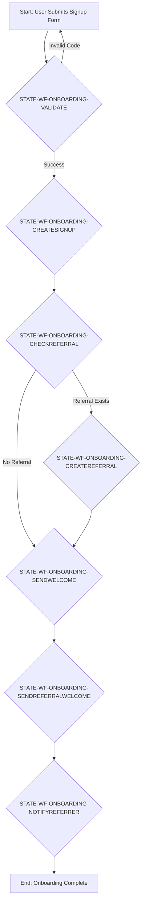
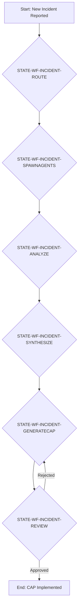

# Harmony AI-Native Care Platform: System Blueprint

**DOCUMENT ID:** `DOC-SYS-BLUEPRINT-001`
**PROJECT:** Harmony AI-Native Care Management Platform
**VERSION:** 1.0
**DATE:** 2026-02-25

---

## 1. Introduction

This document provides a comprehensive, zero-interpretation technical blueprint of the Harmony AI-Native Care Management Platform. It serves as the single source of truth (SSOT) for all system components, their interactions, and the underlying requirements and tasks that govern their implementation. All elements are cross-referenced using the STABLE ID SYSTEM to ensure clarity and traceability.

### 1.1. Project Vision

**REQ-VISION-0001:** To create an AI-native platform that revolutionizes care management in residential facilities by enhancing communication, automating operational tasks, improving resident outcomes, and ensuring regulatory compliance through a suite of intelligent agents and a robust, data-driven architecture.

### 1.2. Mode of Operation

**MODE:** CONSOLIDATE. This project involves unifying existing code, extensive documentation, and new specifications into a cohesive and comprehensive system blueprint.

### 1.3. Repository

**REPO:** `https://github.com/kimhons/harmony-care-website`

## 2. Stable ID System

This system employs a standardized set of identifiers to ensure every artifact within the project is uniquely addressable and traceable.

| Prefix | Description | Example |
|---|---|---|
| `REQ` | Requirements | `REQ-DOMAIN-0001` |
| `TASK` | Atomic work units | `TASK-MODULE-0001` |
| `MOD` | Backend Modules/Services | `MOD-EMAIL` |
| `SCR` | UI Screens | `SCR-HOME` |
| `CMP` | UI Components | `CMP-NAV` |
| `API` | API Endpoints | `API-AUTH-GET-ME` |
| `DM` | Data Models (Tables) | `DM-USERS` |
| `WF` | Workflows | `WF-ONBOARDING-NEWUSER` |
| `STATE`| State within a workflow | `STATE-WF-ONBOARDING-SENDWELCOME` |
| `EVT` | Events | `EVT-USER-CREATED` |
| `GATE`| Gates / Decision Points | `GATE-CHECK-USER-ROLE` |
| `TEST` | Tests | `TEST-AUTH-LOGOUT` |
| `GAP` | Identified Gaps | `GAP-0001` |
| `CONFLICT`| Contradictory information | `CONFLICT-0001` |
| `RISK` | Project Risks | `RISK-0001` |

---

## 3. System Architecture

**REQ-ARCH-0001:** The system must be designed as a hybrid microservices and agentic architecture to support scalability, maintainability, and the integration of AI capabilities.

### 3.1. Detected Surfaces

This table outlines the primary interaction surfaces of the Harmony platform.

| Surface | Technology Stack | Description |
|---|---|---|
| **UI (Web)** | React 19, Tailwind 4, shadcn/ui, Wouter | The primary user interface for all human interaction with the platform. |
| **API** | tRPC 11, Express 4 | The communication layer between the UI and the backend services. |
| **Data** | MySQL/TiDB, Drizzle ORM | The persistence layer for all platform data. |
| **Agents/Automation** | LangChain, LangGraph, CrewAI | The intelligence layer responsible for automation and AI-driven features. |
| **Integrations** | Resend, S3, OAuth, Google Maps | External services that provide critical functionality. |
| **Infra/Ops** | Vercel | The infrastructure and deployment platform. |

### 3.2. Technology Stack

A detailed breakdown of the technologies used across the platform.

| Category | Technology | Version/Details |
|---|---|---|
| **Frontend** | React | 19 |
| | TypeScript | latest |
| | Tailwind CSS | 4 |
| | shadcn/ui | latest |
| | Wouter | latest |
| | Framer Motion | latest |
| | Recharts / Chart.js | latest |
| **Backend** | Node.js | 22.13.0 |
| | Express | 4 |
| | tRPC | 11 |
| | Superjson | latest |
| **Database** | Drizzle ORM | latest |
| | MySQL / TiDB | latest |
| **Authentication** | Manus OAuth | JWT Sessions |
| **Email** | Resend API | latest |
| **Storage** | AWS S3 | latest |
| **Deployment** | Vercel | latest |
| **Testing** | Vitest | 17 test files |

---

## 4. Data Model (Database Schema)

**REQ-DATA-0001:** The database schema must support all entities and their relationships as required by the platform's features, including user management, signups, referrals, and lead generation.

This section details the database schema, managed by Drizzle ORM. Each table is a distinct data model (`DM`).

### 4.1. `DM-USERS`

**Description:** Core user table for authentication and authorization.

| Column | Type | Constraints | Description |
|---|---|---|---|
| `id` | `int` | `autoincrement`, `primaryKey` | Surrogate primary key. |
| `openId` | `varchar(64)` | `notNull`, `unique` | Manus OAuth identifier. |
| `name` | `text` | | User's full name. |
| `email` | `varchar(320)` | | User's email address. |
| `loginMethod`| `varchar(64)` | | Method used for login. |
| `role` | `mysqlEnum('user', 'admin')` | `default('user')`, `notNull` | User role for access control. |
| `createdAt` | `timestamp` | `defaultNow()`, `notNull` | Timestamp of creation. |
| `updatedAt` | `timestamp` | `defaultNow()`, `onUpdateNow()`, `notNull` | Timestamp of last update. |
| `lastSignedIn`| `timestamp` | `defaultNow()`, `notNull` | Timestamp of last sign-in. |

### 4.2. `DM-SIGNUPS`

**Description:** Table for early access and waitlist signups.

| Column | Type | Constraints | Description |
|---|---|---|---|
| `id` | `int` | `autoincrement`, `primaryKey` | Surrogate primary key. |
| `firstName` | `varchar(100)` | `notNull` | User's first name. |
| `lastName` | `varchar(100)` | `notNull` | User's last name. |
| `email` | `varchar(320)` | `notNull` | User's email address. |
| `phone` | `varchar(20)` | | User's phone number. |
| `facilityName`| `varchar(200)` | `notNull` | Name of the user's facility. |
| `facilityType`| `varchar(100)` | `notNull` | Type of the user's facility. |
| `residentCount`| `int` | `notNull` | Number of residents in the facility. |
| `tier` | `varchar(50)` | `notNull` | Selected pricing tier. |
| `interestedFeatures`| `text` | | JSON array of selected features. |
| `additionalNeeds`| `text` | | Additional needs or comments. |
| `createdAt` | `timestamp` | `defaultNow()`, `notNull` | Timestamp of creation. |
| `emailsSent` | `text` | | JSON array of sent email types and timestamps. |
| `lastEmailSent`| `timestamp` | | Timestamp of the last email sent. |
| `emailOptOut` | `int` | `default(0)`, `notNull` | 0 for opted-in, 1 for opted-out. |
| `campaignStatus`| `varchar(50)` | `default('active')`, `notNull` | Status of the email campaign. |
| `utmSource` | `varchar(100)` | | UTM source parameter. |
| `utmMedium` | `varchar(100)` | | UTM medium parameter. |
| `utmCampaign` | `varchar(100)` | | UTM campaign parameter. |
| `utmTerm` | `varchar(100)` | | UTM term parameter. |
| `utmContent` | `varchar(100)` | | UTM content parameter. |
| `referralCode` | `varchar(20)` | | Referral code used during signup. |
| `ownReferralCode`| `varchar(20)` | `unique` | Unique referral code for this user. |

### 4.3. `DM-REFERRALS`

**Description:** Tracks referral relationships and rewards.

| Column | Type | Constraints | Description |
|---|---|---|---|
| `id` | `int` | `autoincrement`, `primaryKey` | Surrogate primary key. |
| `referrerSignupId`| `int` | `notNull` | ID of the referrer. |
| `referredSignupId`| `int` | `notNull` | ID of the referred user. |
| `referralCode` | `varchar(20)` | `notNull` | The referral code used. |
| `rewardStatus` | `varchar(50)` | `default('pending')`, `notNull` | Status of the reward. |
| `rewardType` | `varchar(50)` | | Type of reward. |
| `rewardValue` | `varchar(100)` | | Value of the reward. |
| `createdAt` | `timestamp` | `defaultNow()`, `notNull` | Timestamp of creation. |

### 4.4. `DM-MILESTONENOTIFICATIONS`

**Description:** Tracks milestone achievements for gamification.

| Column | Type | Constraints | Description |
|---|---|---|---|
| `id` | `int` | `autoincrement`, `primaryKey` | Surrogate primary key. |
| `signupId` | `int` | `notNull` | ID of the signup that achieved the milestone. |
| `milestoneId` | `varchar(50)` | `notNull` | Unique ID for the milestone. |
| `milestoneType` | `varchar(50)` | `notNull` | Type of milestone. |
| `title` | `varchar(200)` | `notNull` | Title of the milestone notification. |
| `description` | `text` | `notNull` | Description of the milestone. |
| `badgePath` | `varchar(500)` | `notNull` | Path to the badge graphic. |
| `isViewed` | `int` | `default(0)`, `notNull` | 0 for not viewed, 1 for viewed. |
| `isShared` | `int` | `default(0)`, `notNull` | 0 for not shared, 1 for shared. |
| `createdAt` | `timestamp` | `defaultNow()`, `notNull` | Timestamp of creation. |

### 4.5. `DM-CALCULATORLEADS`

**Description:** Stores submissions from the ROI calculator.

| Column | Type | Constraints | Description |
|---|---|---|---|
| `id` | `int` | `autoincrement`, `primaryKey` | Surrogate primary key. |
| `email` | `varchar(320)` | `notNull` | Lead's email address. |
| `name` | `varchar(200)` | | Lead's name. |
| `facilityName`| `varchar(200)` | | Name of the lead's facility. |
| `facilityType`| `varchar(50)` | `notNull` | Type of the lead's facility. |
| `residentCount`| `int` | `notNull` | Number of residents in the facility. |
| `annualSavings`| `int` | `notNull` | Calculated annual savings. |
| `overtimeSavings`| `int` | `notNull` | Calculated overtime savings. |
| `errorSavings`| `int` | `notNull` | Calculated error reduction savings. |
| `complianceSavings`| `int` | `notNull` | Calculated compliance savings. |
| `retentionSavings`| `int` | `notNull` | Calculated staff retention savings. |
| `source` | `varchar(50)` | `default('calculator')`, `notNull` | Source of the lead. |
| `utmSource` | `varchar(100)` | | UTM source parameter. |
| `utmMedium` | `varchar(100)` | | UTM medium parameter. |
| `utmCampaign` | `varchar(100)` | | UTM campaign parameter. |
| `utmTerm` | `varchar(100)` | | UTM term parameter. |
| `utmContent` | `varchar(100)` | | UTM content parameter. |
| `emailSent` | `int` | `default(0)`, `notNull` | 0 for not sent, 1 for sent. |
| `emailSentAt` | `timestamp` | | Timestamp of when the email was sent. |
| `nurtureSequence`| `text` | | JSON array of the nurture email sequence. |
| `lastNurtureEmail`| `varchar(50)` | | The last nurture email that was sent. |
| `lastNurtureEmailSentAt`| `timestamp` | | Timestamp of the last nurture email sent. |
| `nurtureCompleted`| `int` | `default(0)`, `notNull` | 0 for in progress, 1 for completed. |
| `leadScore` | `int` | `default(0)`, `notNull` | Lead score from 0-100. |
| `leadTier` | `varchar(20)` | `default('cold')`, `notNull` | Lead tier: 'hot', 'warm', or 'cold'. |
| `engagementScore`| `int` | `default(0)`, `notNull` | Score based on email opens, clicks, etc. |
| `lastEngagementAt`| `timestamp` | | Timestamp of the last engagement. |
| `createdAt` | `timestamp` | `defaultNow()`, `notNull` | Timestamp of creation. |

### 4.6. `DM-LEADMAGNETS`

**Description:** Stores information about downloadable lead magnets.

| Column | Type | Constraints | Description |
|---|---|---|---|
| `id` | `int` | `autoincrement`, `primaryKey` | Surrogate primary key. |
| `title` | `varchar(200)` | `notNull` | Title of the lead magnet. |
| `description` | `text` | `notNull` | Description of the lead magnet. |
| `type` | `varchar(50)` | `notNull` | Type of lead magnet. |
| `category` | `varchar(50)` | `notNull` | Category of the lead magnet. |
| `fileUrl` | `varchar(500)` | `notNull` | URL to the lead magnet file. |
| `thumbnailUrl` | `varchar(500)` | | URL to the thumbnail image. |
| `fileSize` | `int` | | File size in KB. |
| `downloadCount` | `int` | `default(0)`, `notNull` | Number of times the lead magnet has been downloaded. |
| `isActive` | `int` | `default(1)`, `notNull` | 0 for hidden, 1 for visible. |
| `sortOrder` | `int` | `default(0)`, `notNull` | Manual sort order. |
| `createdAt` | `timestamp` | `defaultNow()`, `notNull` | Timestamp of creation. |
| `updatedAt` | `timestamp` | `defaultNow()`, `onUpdateNow()`, `notNull` | Timestamp of last update. |

### 4.7. `DM-LEADMAGNETDOWNLOADS`

**Description:** Tracks who has downloaded which lead magnet.

| Column | Type | Constraints | Description |
|---|---|---|---|
| `id` | `int` | `autoincrement`, `primaryKey` | Surrogate primary key. |
| `leadMagnetId` | `int` | `notNull` | ID of the downloaded lead magnet. |
| `email` | `varchar(320)` | `notNull` | Downloader's email address. |
| `name` | `varchar(200)` | | Downloader's name. |
| `facilityName`| `varchar(200)` | | Name of the downloader's facility. |
| `facilityType`| `varchar(50)` | | Type of the downloader's facility. |
| `residentCount`| `int` | | Number of residents in the facility. |
| `jobTitle` | `varchar(100)` | | Downloader's job title. |
| `phoneNumber` | `varchar(20)` | | Downloader's phone number. |
| `calculatorLeadId`| `int` | | ID of the corresponding calculator lead. |
| `utmSource` | `varchar(100)` | | UTM source parameter. |
| `utmMedium` | `varchar(100)` | | UTM medium parameter. |
| `utmCampaign` | `varchar(100)` | | UTM campaign parameter. |
| `ipAddress` | `varchar(45)` | | IP address of the downloader. |
| `userAgent` | `text` | | User agent of the downloader. |
| `downloadedAt` | `timestamp` | `defaultNow()`, `notNull` | Timestamp of the download. |
| `nurtureSequence`| `text` | | JSON array of the nurture email sequence. |
| `lastNurtureEmail`| `varchar(50)` | | The last nurture email that was sent. |
| `lastNurtureEmailSentAt`| `timestamp` | | Timestamp of the last nurture email sent. |
| `nurtureCompleted`| `int` | `default(0)`, `notNull` | 0 for in progress, 1 for completed. |

### 4.8. `DM-NEWSLETTERSUBSCRIBERS`

**Description:** Tracks subscribers to the blog newsletter.

| Column | Type | Constraints | Description |
|---|---|---|---|
| `id` | `int` | `autoincrement`, `primaryKey` | Surrogate primary key. |
| `email` | `varchar(320)` | `notNull`, `unique` | Subscriber's email address. |
| `name` | `varchar(200)` | | Subscriber's name. |
| `source` | `varchar(100)` | `notNull` | Source of the subscription. |
| `status` | `varchar(20)` | `default('active')`, `notNull` | Status of the subscription. |
| `utmSource` | `varchar(100)` | | UTM source parameter. |
| `utmMedium` | `varchar(100)` | | UTM medium parameter. |
| `utmCampaign` | `varchar(100)` | | UTM campaign parameter. |
| `nurtureSequence`| `text` | | JSON array of the nurture email sequence. |
| `lastNurtureEmail`| `varchar(50)` | | The last nurture email that was sent. |
| `lastNurtureEmailSentAt`| `timestamp` | | Timestamp of the last nurture email sent. |
| `nurtureCompleted`| `int` | `default(0)`, `notNull` | 0 for in progress, 1 for completed. |
| `emailOpens` | `int` | `default(0)`, `notNull` | Number of email opens. |
| `emailClicks` | `int` | `default(0)`, `notNull` | Number of email clicks. |
| `lastEngagementAt`| `timestamp` | | Timestamp of the last engagement. |
| `subscribedAt` | `timestamp` | `defaultNow()`, `notNull` | Timestamp of the subscription. |
| `unsubscribedAt`| `timestamp` | | Timestamp of when the user unsubscribed. |

---

## 5. API Surface (Routers)

**REQ-API-0001:** The API must provide a clear, well-defined, and secure interface for the frontend application to interact with backend services.

This section details the tRPC routers that constitute the API surface. Each router is a module (`MOD`) and its procedures are API endpoints (`API`).

### 5.1. `MOD-SYSTEM` (`systemRouter`)

**Description:** Core system router for health checks and status.

| Procedure | Path | Method | Description | ID |
|---|---|---|---|---|
| `health` | `system.health` | `query` | Returns the health status of the system. | `API-SYSTEM-GET-HEALTH` |

### 5.2. `MOD-AUTH` (`auth`)

**Description:** Handles user authentication and session management.

| Procedure | Path | Method | Description | ID |
|---|---|---|---|---|
| `me` | `auth.me` | `query` | Retrieves the current user's session data. | `API-AUTH-GET-ME` |
| `logout` | `auth.logout` | `mutation` | Clears the user's session cookie. | `API-AUTH-POST-LOGOUT` |

### 5.3. `MOD-ADMIN` (`admin`)

**Description:** Provides administrative functionalities and analytics.

| Procedure | Path | Method | Description | ID |
|---|---|---|---|---|
| `analytics` | `admin.analytics` | `query` | Retrieves comprehensive analytics for the admin dashboard. | `API-ADMIN-GET-ANALYTICS` |
| `signups` | `admin.signups` | `query` | Retrieves all signup records. | `API-ADMIN-GET-SIGNUPS` |
| `exportCSV` | `admin.exportCSV` | `query` | Exports all signup data to a CSV file. | `API-ADMIN-GET-EXPORTCSV` |

### 5.4. `MOD-SIGNUP` (`signup`)

**Description:** Handles the creation of new user signups.

| Procedure | Path | Method | Description | ID |
|---|---|---|---|---|
| `create` | `signup.create` | `mutation` | Creates a new signup record. | `API-SIGNUP-POST-CREATE` |

### 5.5. `MOD-REFERRAL` (`referral`)

**Description:** Manages the referral program, including validation, creation, and analytics.

| Procedure | Path | Method | Description | ID |
|---|---|---|---|---|
| `validate` | `referral.validate` | `query` | Validates a given referral code. | `API-REFERRAL-GET-VALIDATE` |
| `create` | `referral.create` | `mutation` | Creates a new referral relationship. | `API-REFERRAL-POST-CREATE` |
| `analytics` | `referral.analytics` | `query` | Retrieves referral analytics. | `API-REFERRAL-GET-ANALYTICS` |
| `milestones` | `referral.milestones` | `router` | Sub-router for milestone management. | `API-REFERRAL-ROUTER-MILESTONES` |

### 5.6. `MOD-CALCULATOR` (`calculatorRouter`)

**Description:** Handles the ROI calculator logic.

| Procedure | Path | Method | Description | ID |
|---|---|---|---|---|
| `calculate` | `calculator.calculate` | `mutation` | Calculates savings based on user input. | `API-CALCULATOR-POST-CALCULATE` |

### 5.7. `MOD-ADMINCALCULATORLEADS` (`adminCalculatorLeadsRouter`)

**Description:** Manages calculator leads for admins.

| Procedure | Path | Method | Description | ID |
|---|---|---|---|---|
| `list` | `adminCalculatorLeads.list` | `query` | Lists all calculator leads. | `API-ADMINCALCULATORLEADS-GET-LIST` |

### 5.8. `MOD-RESENDWEBHOOK` (`resendWebhookRouter`)

**Description:** Handles webhooks from the Resend email service.

| Procedure | Path | Method | Description | ID |
|---|---|---|---|---|
| `handle` | `resendWebhook.handle` | `mutation` | Handles incoming webhook events. | `API-RESENDWEBHOOK-POST-HANDLE` |

### 5.9. `MOD-LEADMAGNETS` (`leadMagnetsRouter`)

**Description:** Manages lead magnets.

| Procedure | Path | Method | Description | ID |
|---|---|---|---|---|
| `list` | `leadMagnets.list` | `query` | Lists all available lead magnets. | `API-LEADMAGNETS-GET-LIST` |
| `download` | `leadMagnets.download` | `mutation` | Records a lead magnet download. | `API-LEADMAGNETS-POST-DOWNLOAD` |

### 5.10. `MOD-FILEUPLOAD` (`fileUploadRouter`)

**Description:** Handles file uploads.

| Procedure | Path | Method | Description | ID |
|---|---|---|---|---|
| `createPresignedUrl` | `fileUpload.createPresignedUrl` | `mutation` | Creates a presigned URL for S3 uploads. | `API-FILEUPLOAD-POST-CREATEPRESIGNEDURL` |

### 5.11. `MOD-NEWSLETTER` (`newsletterRouter`)

**Description:** Manages newsletter subscriptions.

| Procedure | Path | Method | Description | ID |
|---|---|---|---|---|
| `subscribe` | `newsletter.subscribe` | `mutation` | Subscribes a user to the newsletter. | `API-NEWSLETTER-POST-SUBSCRIBE` |

### 5.12. `MOD-EMAILENGAGEMENT` (`emailEngagementRouter`)

**Description:** Tracks email engagement metrics.

| Procedure | Path | Method | Description | ID |
|---|---|---|---|---|
| `trackOpen` | `emailEngagement.trackOpen` | `mutation` | Tracks an email open event. | `API-EMAILENGAGEMENT-POST-TRACKOPEN` |

---

## 6. UI Surface (Screens and Components)

**REQ-UI-0001:** The user interface must be intuitive, responsive, and provide a seamless user experience across all devices.

This section details the web-based user interface, composed of screens (`SCR`) and reusable components (`CMP`).

### 6.1. Screens (`SCR`)

| Screen Name | File Name | Description | ID |
|---|---|---|---|
| Home | `Home.tsx` | Landing page with hero, agents showcase, features, and outcomes. | `SCR-HOME` |
| Signup | `Signup.tsx` | Early access signup form. | `SCR-SIGNUP` |
| Admin | `Admin.tsx` | Admin dashboard with analytics. | `SCR-ADMIN` |
| Admin Calculator Leads | `AdminCalculatorLeads.tsx` | Page for managing calculator leads. | `SCR-ADMIN-CALC-LEADS` |
| Admin Resources | `AdminResources.tsx` | Page for managing resources. | `SCR-ADMIN-RESOURCES` |
| Email Engagement | `EmailEngagement.tsx` | Page for email engagement analytics. | `SCR-EMAIL-ENGAGEMENT` |
| Referrals | `Referrals.tsx` | Referral program page. | `SCR-REFERRALS` |
| Pricing | `Pricing.tsx` | 3-tier pricing page. | `SCR-PRICING` |
| About | `About.tsx` | About page. | `SCR-ABOUT` |
| Blog | `Blog.tsx` | Blog listing page. | `SCR-BLOG` |
| Blog Article | `BlogArticle.tsx` | Individual blog article page. | `SCR-BLOG-ARTICLE` |
| Agents | `Agents.tsx` | AI agents showcase page. | `SCR-AGENTS` |
| Demo | `Demo.tsx` | Demo request page. | `SCR-DEMO` |
| Group Homes | `GroupHomes.tsx` | Solutions for group homes page. | `SCR-GROUP-HOMES` | 
| ICF-ID | `IcfId.tsx` | Solutions for ICF-ID facilities page. | `SCR-ICF-ID` |
| Resources | `Resources.tsx` | Resources hub page. | `SCR-RESOURCES` |
| Resource Landing Pages | `resources/*.tsx` | Landing pages for specific resources. | `SCR-RESOURCE-LANDING` |
| Not Found | `NotFound.tsx` | 404 page. | `SCR-NOT-FOUND` |

### 6.2. Components (`CMP`)

| Component Name | File Name | Description | ID |
|---|---|---|---|
| Navigation | `Navigation.tsx` | Main navigation bar. | `CMP-NAV` |
| Footer | `Footer.tsx` | Site footer. | `CMP-FOOTER` |
| AI Chat Box | `AIChatBox.tsx` | AI chat interface. | `CMP-AI-CHAT-BOX` |
| Savings Calculator | `SavingsCalculator.tsx` | Interactive ROI calculator. | `CMP-SAVINGS-CALCULATOR` |
| Cost Savings Chart | `CostSavingsChart.tsx` | Chart component for displaying cost savings. | `CMP-COST-SAVINGS-CHART` |
| Animated Counter | `AnimatedCounter.tsx` | Animated number counter. | `CMP-ANIMATED-COUNTER` |
| Comparison Table | `ComparisonTable.tsx` | Feature comparison table. | `CMP-COMPARISON-TABLE` |
| Dashboard Layout | `DashboardLayout.tsx` | Layout for the admin dashboard. | `CMP-DASHBOARD-LAYOUT` |
| Exit Intent Popup | `ExitIntentPopup.tsx` | Popup that appears when a user is about to leave the site. | `CMP-EXIT-INTENT-POPUP` |
| Featured Resources | `FeaturedResources.tsx` | Cards for displaying featured resources. | `CMP-FEATURED-RESOURCES` | 
| Live Chat | `LiveChat.tsx` | Live chat widget. | `CMP-LIVE-CHAT` |
| Milestone Celebration | `MilestoneCelebration.tsx` | Component for celebrating milestones. | `CMP-MILESTONE-CELEBRATION` |
| Newsletter Signup | `NewsletterSignup.tsx` | Form for newsletter signup. | `CMP-NEWSLETTER-SIGNUP` |
| Resource Landing Template | `ResourceLandingTemplate.tsx` | Template for resource landing pages. | `CMP-RESOURCE-LANDING-TEMPLATE` |
| SEO Head | `SEOHead.tsx` | Component for managing SEO meta tags. | `CMP-SEO-HEAD` |
| Share Templates | `ShareTemplates.tsx` | Component for social sharing. | `CMP-SHARE-TEMPLATES` |
| Video Modal | `VideoModal.tsx` | Modal for playing videos. | `CMP-VIDEO-MODAL` |
| shadcn/ui Components | `ui/*` | UI components from the shadcn/ui library. | `CMP-SHADCN-UI` |

---

## 7. Agents & Automation

**REQ-AGENT-0001:** The platform must include a suite of AI agents to automate tasks, provide insights, and enhance user engagement.

This section details the AI agents that form the intelligence layer of the Harmony platform. The agents are organized into five domains.

### 7.1. Agent Domains

| Domain | Agents | Description |
|---|---|---|
| **Engagement** | Connect, Pulse, Advocate, Catalyst, Executive Assistant | Agents focused on improving communication and engagement with residents, families, and staff. |
| **Health Monitoring** | Sentinel, Vitals, MedGuard, Wellness | Agents dedicated to monitoring resident health and well-being. |
| **Compliance** | Guardian, Auditor, Regulator, Inspector | Agents that ensure the facility adheres to all regulatory requirements. |
| **Operations** | Nexus, Coordinator, Communicator, Dispatcher | Agents that streamline and automate facility operations. |
| **Analytics** | Compass, Analyst, Forecaster, Optimizer | Agents that provide data-driven insights and predictive analytics. |

### 7.2. Agent Specifications

This section provides detailed specifications for each agent, including their purpose, framework, responsibilities, and required tools.

#### 7.2.1. `Connect` (Family & Resident Portal Agent)

*   **Purpose:** Fosters communication and transparency between the facility, residents, and their families.
*   **Framework:** LangGraph
*   **Responsibilities:** Provides non-clinical updates, facilitates scheduling of calls and visits, answers FAQs, allows residents to send messages, and broadcasts announcements.
*   **Tools:** `get_resident_activity_log`, `schedule_family_visit`, `get_facility_faq`, `send_family_message`, `broadcast_announcement`

#### 7.2.2. `Pulse` (Staff Engagement Agent)

*   **Purpose:** Improves staff morale, reduces burnout, and decreases turnover.
*   **Framework:** LangGraph
*   **Responsibilities:** Conducts pulse check surveys, analyzes sentiment, facilitates peer-to-peer recognition, provides access to HR resources, and alerts leadership to negative sentiment trends.
*   **Tools:** `send_pulse_survey`, `analyze_sentiment`, `create_peer_recognition`, `get_hr_resource`, `generate_sentiment_report`

#### 7.2.3. `Advocate` (Quality Improvement Agent)

*   **Purpose:** Drives a data-driven quality improvement culture.
*   **Framework:** CrewAI
*   **Responsibilities:** Investigates incidents, identifies root causes, generates Corrective Action Plans (CAPs), and tracks their implementation.
*   **Tools:** `get_incident_details`, `review_care_plan_history`, `analyze_staffing_data`, `check_protocol_compliance`, `generate_cap_draft`

#### 7.2.4. `Catalyst` (Admissions & CRM Agent)

*   **Purpose:** Streamlines the admissions process and manages relationships with prospective residents.
*   **Framework:** LangGraph
*   **Responsibilities:** Engages with leads, schedules tours, nurtures leads with follow-up emails, guides families through paperwork, and manages the CRM.
*   **Tools:** `create_lead`, `schedule_facility_tour`, `send_follow_up_email`, `get_admissions_checklist`, `update_lead_stage`

#### 7.2.5. `Executive Assistant` (Admin & Leadership Agent)

*   **Purpose:** Provides administrative support and data-driven insights to leadership.
*   **Framework:** LangGraph
*   **Responsibilities:** Generates operational reports, summarizes agent findings, helps schedule meetings, answers ad-hoc questions, and drafts internal communications.
*   **Tools:** `generate_operational_report`, `summarize_agent_findings`, `schedule_leadership_meeting`, `query_platform_data`, `draft_internal_memo`

#### 7.2.6. `Nexus` (Scheduling & Staffing Agent)

*   **Purpose:** Optimizes staff scheduling to ensure compliance and meet resident care needs.
*   **Framework:** LangGraph
*   **Responsibilities:** Generates draft schedules, optimizes for cost, manages shift swaps and time-off requests, identifies scheduling gaps, and notifies staff of their shifts.
*   **Tools:** `get_staff_availability`, `get_staffing_requirements`, `optimize_schedule`, `publish_schedule`, `process_shift_swap_request`

#### 7.2.7. `HR Manager` (Human Resources Agent)

*   **Purpose:** Automates routine HR tasks from recruitment to offboarding.
*   **Framework:** LangGraph
*   **Responsibilities:** Screens applications, schedules interviews, automates onboarding, tracks performance reviews, and manages offboarding.
*   **Tools:** `screen_applications`, `schedule_interview`, `initiate_onboarding`, `track_performance_review`, `generate_offboarding_checklist`

#### 7.2.8. `Maintenance Coordinator` (Facilities Agent)

*   **Purpose:** Manages the facility's physical assets and maintenance schedules.
*   **Framework:** LangGraph
*   **Responsibilities:** Manages preventative maintenance, handles repair requests, monitors work orders, orders supplies, and analyzes maintenance data.
*   **Tools:** `get_pm_schedule`, `create_work_order`, `assign_work_order`, `order_parts`, `get_maintenance_history`

#### 7.2.9. `Nutrition Specialist` (Dietary Agent)

*   **Purpose:** Manages resident dietary needs, from meal planning to inventory management.
*   **Framework:** LangGraph
*   **Responsibilities:** Creates personalized meal plans, generates production sheets for the kitchen, manages dietary restrictions, tracks food inventory, and assists with ordering.
*   **Tools:** `get_resident_dietary_profile`, `generate_meal_plan`, `create_kitchen_production_sheet`, `check_inventory_levels`, `place_food_order`

#### 7.2.10. `Transportation Manager` (Logistics Agent)

*   **Purpose:** Coordinates all resident transportation needs efficiently and safely.
*   **Framework:** LangGraph
*   **Responsibilities:** Manages transportation requests, optimizes routes, assigns drivers and vehicles, monitors vehicle maintenance, and notifies residents of pickup times.
*   **Tools:** `get_transport_requests`, `optimize_routes`, `assign_driver_and_vehicle`, `get_vehicle_maintenance_status`, `notify_resident_of_pickup`

---

## 8. Workflows

**REQ-WF-0001:** The system must support complex, multi-step workflows for key business processes such as user onboarding, incident investigation, and lead nurturing.

This section outlines the key workflows (`WF`) that orchestrate actions across different modules and agents. Each workflow is a state machine, moving through various states (`STATE`) to completion.

### 8.1. `WF-ONBOARDING-NEWSIGNUP`

**Description:** Handles the complete process for a new user signing up for early access.

| State ID | Description |
|---|---|
| `STATE-WF-ONBOARDING-VALIDATE` | Validates the provided referral code, if any. Cross-references `API-REFERRAL-GET-VALIDATE`. |
| `STATE-WF-ONBOARDING-CREATESIGNUP` | Creates the new signup record in the database. Cross-references `API-SIGNUP-POST-CREATE` and `DM-SIGNUPS`. |
| `STATE-WF-ONBOARDING-CHECKREFERRAL` | Checks if a valid referral was part of the signup. |
| `STATE-WF-ONBOARDING-CREATEREFERRAL` | Creates the referral link in the database. Cross-references `API-REFERRAL-POST-CREATE` and `DM-REFERRALS`. |
| `STATE-WF-ONBOARDING-SENDWELCOME` | Sends a standard welcome email to the new user. Cross-references `MOD-EMAIL`. |
| `STATE-WF-ONBOARDING-SENDREFERRALWELCOME` | Sends an email containing the new user's own referral code. |
| `STATE-WF-ONBOARDING-NOTIFYREFERRER` | Notifies the original referrer of the successful referral and checks for milestone achievements. |

### 8.2. `WF-INCIDENT-INVESTIGATION`

**Description:** The workflow for investigating a reported incident, orchestrated by the `Advocate` agent.

| State ID | Description |
|---|---|
| `STATE-WF-INCIDENT-ROUTE` | The `Concierge` agent receives the incident and routes it to the `Advocate` agent. |
| `STATE-WF-INCIDENT-SPAWNAGENTS` | The `Advocate` (CrewAI) agent spawns specialized sub-agents (Clinical, Operational, Historical Analysts). |
| `STATE-WF-INCIDENT-ANALYZE` | Sub-agents gather and analyze data in parallel using tools like `get_incident_details` and `review_care_plan_history`. |
| `STATE-WF-INCIDENT-SYNTHESIZE` | The `Advocate` agent aggregates the findings from all sub-agents to determine the root cause. |
| `STATE-WF-INCIDENT-GENERATECAP` | A draft Corrective Action Plan (CAP) is generated using `generate_cap_draft`. |
| `STATE-WF-INCIDENT-REVIEW` | The draft CAP is presented to a human (e.g., Director of Nursing) for review and approval (Human-in-the-Loop). |

---

## 9. Security

**REQ-SEC-0001:** The platform must ensure the confidentiality, integrity, and availability of all user and resident data.

This section outlines the security measures implemented across the Harmony platform.

### 9.1. Authentication

*   **`GATE-AUTH-OAUTH`**: All user authentication is handled through Manus OAuth, providing a secure and standardized login process.
*   **`GATE-AUTH-JWT`**: User sessions are managed using JSON Web Tokens (JWTs), which are stored in secure, HTTP-only cookies.

### 9.2. Authorization

*   **`GATE-AUTH-ROLE`**: Role-based access control (RBAC) is implemented at the API layer. The user's role is checked (`DM-USERS.role`) before any protected resource is accessed.
*   **`GATE-AUTH-PERMISSION`**: The agentic layer enforces fine-grained permissions. Tools within the Tool Layer check for specific permissions (e.g., `create:incident`) before execution, as demonstrated in the `create_incident_report` tool example.

### 9.3. Data Security

*   **Data in Transit**: All communication between the client, server, and external services is encrypted using TLS/SSL.
*   **Data at Rest**: Sensitive data stored in the database and S3 is encrypted at rest.

### 9.4. Auditing

*   **`TASK-AUDIT-0001`**: All tool invocations by AI agents are logged with detailed information, including the invoking agent, input parameters, and success/failure status. This creates a comprehensive audit trail of all automated actions.

---
## 10. DevOps

**REQ-DEVOPS-0001:** The platform must have a streamlined and automated deployment process to ensure rapid and reliable delivery of new features and fixes.

### 10.1. Deployment

*   **`TASK-DEPLOY-0001`**: The entire platform is deployed to Vercel. The frontend and backend are deployed as a single, unified application.

### 10.2. Continuous Integration/Continuous Deployment (CI/CD)

*   **`GAP-0001`**: A formal CI/CD pipeline has been planned but is not yet implemented. This is a critical gap that needs to be addressed to automate testing and deployment.
*   **`TASK-CICD-0001`**: Implement a CI/CD pipeline using GitHub Actions or a similar tool. The pipeline should run all Vitest tests (`TEST-*`) on every push and automatically deploy to Vercel on merge to the main branch.

---

## 11. Gaps, Conflicts, and Risks

This section identifies known gaps, conflicts, and risks in the project.

### 11.1. Gaps (`GAP`)

*   **`GAP-0001`**: **CI/CD Pipeline Not Implemented.** As mentioned in the DevOps section, the lack of an automated CI/CD pipeline is a major gap. This increases the risk of manual deployment errors and slows down the development lifecycle. **Associated Task:** `TASK-CICD-0001`.
*   **`GAP-0002`**: **Incomplete Product Pages.** The `todo.md` indicates that several key product pages are not yet complete, including pages for the 15 AI agents, features, dashboards, integrations, and security. **Associated Task:** `TASK-UI-0001`: Complete all remaining product pages as outlined in `todo.md`.

### 11.2. Conflicts (`CONFLICT`)

*   **`CONFLICT-0001`**: **Inconsistent Naming in `harmony_schema.txt`**. The schema file `harmony_schema.txt` uses `isViewed` and `isShared` in `DM-MILESTONENOTIFICATIONS`, but the rest of the schema uses integer-based booleans (0/1) like `isActive` in `DM-LEADMAGNETS`. This should be standardized. **Associated Task:** `TASK-DB-0001`: Refactor `DM-MILESTONENOTIFICATIONS` to use `viewed` and `shared` with type `int` and default `0` for consistency.

### 11.3. Risks (`RISK`)

*   **`RISK-0001`**: **Agent Complexity.** The plan to develop 20 distinct AI agents presents a significant technical and project management risk. The complexity of developing, testing, and orchestrating these agents could lead to delays and unforeseen challenges. **Mitigation:** Implement agents in phases, starting with the highest-value and lowest-complexity agents first.

---
