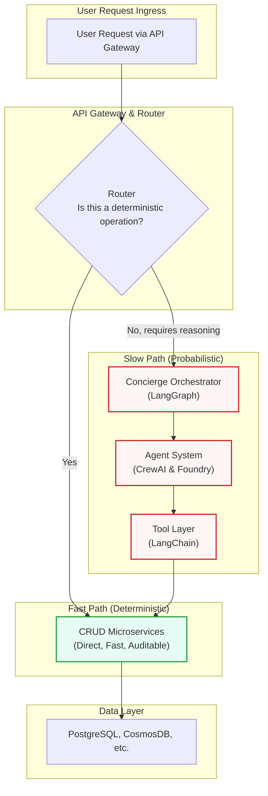
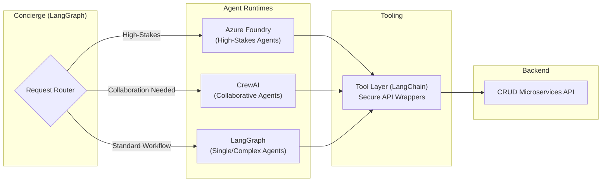

# Refined Hybrid Architecture: CRUD + Agentic Integration

**Author:** Manus AI  
**Date:** November 27, 2025  
**Version:** 2.0

## 1. Core Principle: The Harmony Pattern

Based on the architectural review, the core of the refined design is the **Harmony Pattern**. This pattern establishes a clear boundary between deterministic CRUD operations and probabilistic agentic reasoning, ensuring reliability, auditability, and performance while still leveraging the power of AI.

It introduces a dual-pathway for handling incoming requests:

*   **Fast Path**: For simple, deterministic CRUD operations that do not require AI reasoning. These are routed directly to the appropriate microservice.
*   **Slow Path**: For complex queries and commands that require reasoning, synthesis, or multi-step execution. These are routed to the agentic layer.



## 2. Incremental Framework Adoption Strategy

To manage complexity and reduce risk, the agentic frameworks will be adopted incrementally across three phases. This allows the team to master one framework before adding the next.

### Phase 1: Foundation (LangGraph + LangChain)

*   **Orchestrator**: **LangGraph** will be the primary orchestrator for all agentic workflows.
*   **Tooling**: **LangChain** will be used to build the essential **Tool Layer**, creating a secure, auditable bridge between agents and the CRUD API.
*   **Focus**: Prove the core pattern. Build the `Concierge` and the first 4-6 agents using a single, robust orchestration engine. Establish state management and human-in-the-loop workflows.

### Phase 2: Collaboration (Introduce CrewAI)

*   **Orchestrator**: **CrewAI** will be introduced for specialized multi-agent collaboration tasks.
*   **Integration**: LangGraph will remain the master orchestrator (`Concierge`), but it will be able to delegate specific tasks to a `Crew` of agents managed by CrewAI.
*   **Focus**: Enable more complex, parallelized agentic workflows. The `Advocate` agent, for example, would use CrewAI to spawn sub-agents for parallel investigation.

### Phase 3: Enterprise Scale (Introduce Azure Foundry)

*   **Orchestrator**: **Azure Foundry Agent Service** will be adopted for mission-critical, production-hardened agents.
*   **Integration**: The `Concierge` will route high-stakes requests (e.g., compliance audits, medication safety checks) to agents hosted on Azure Foundry.
*   **Focus**: Achieve enterprise-grade reliability, observability, and compliance. The `Guardian`, `Sentinel`, and `Vanguard` agents will be migrated to Foundry to leverage its managed environment, content safety, and superior audit trails.

This results in a powerful, flexible hybrid system:



## 3. Detailed Component Responsibilities

### API Gateway & Router (Fast/Slow Path)
*   **Responsibility**: The first point of contact for all incoming requests. It inspects the request to determine if it can be handled directly by a CRUD service or if it requires agentic reasoning.
*   **Implementation**: This logic can be implemented in the Azure API Management layer or a dedicated lightweight service. A simple rules engine will be used:
    *   If `request.path` matches a known, simple CRUD endpoint (e.g., `GET /residents/{id}`), route to the `ResidentService` (Fast Path).
    *   If `request.path` is a generic query endpoint (e.g., `POST /query`), or contains complex filter parameters, forward to the `Concierge` (Slow Path).

### The Concierge (Master Orchestrator)
*   **Framework**: LangGraph
*   **Responsibility**: The brain of the slow path. It receives a complex request, classifies the user's intent, and routes it to the appropriate agent or team of agents.
*   **Workflow**:
    1.  **Receive Request**: Gets a natural language query (e.g., "Summarize recent incidents for high-fall-risk residents").
    2.  **Classify Intent**: Uses a fast LLM (e.g., Claude 3 Sonnet) to classify the intent (e.g., `incident_summary`, `risk_analysis`).
    3.  **Route to Agent**: Based on the intent, it invokes the correct agent graph (e.g., the `Advocate` agent).
    4.  **Aggregate & Respond**: Receives the structured output from the agent, formats it, and returns it to the user.

### The Tool Layer (The Bridge)
*   **Framework**: LangChain
*   **Responsibility**: A critical security and abstraction layer. **Agents NEVER access the database directly.** They only interact with the system through this layer of well-defined, auditable tools.
*   **Design Principles**:
    1.  **Schema-Defined**: Every tool has a strict input/output schema (using Pydantic or Zod).
    2.  **Permissioned**: The tool layer enforces RBAC, checking if the invoking agent has the right to perform the action.
    3.  **Auditable**: Every tool call is logged with parameters, invoker, and result.
    4.  **CRUD Wrapper**: Tools are essentially secure wrappers around the backend CRUD API endpoints.

**Example Tool Definition (LangChain)**:
```python
from langchain_core.tools import tool
from pydantic import BaseModel, Field

class GetResidentInput(BaseModel):
    resident_id: str = Field(description="The unique ID of the resident")

@tool("get_resident_details", args_schema=GetResidentInput)
def get_resident_details(resident_id: str) -> dict:
    """Fetches the complete profile for a single resident."""
    # 1. Log the tool call
    log_tool_call("get_resident_details", {"resident_id": resident_id})
    
    # 2. Check permissions (pseudo-code)
    if not has_permission(agent_context, "read:resident"): 
        return {"error": "Permission denied"}

    # 3. Call the actual CRUD service
    response = requests.get(f"https://api.harmonycare.ai/residents/{resident_id}")
    return response.json()
```

## 4. Conclusion

This refined architecture provides a robust, scalable, and secure foundation for integrating CRUD and agentic systems. It mitigates risk by:

*   **Establishing Clear Boundaries**: The Harmony Pattern separates deterministic and probabilistic workflows.
*   **Managing Complexity**: Frameworks are introduced incrementally, not all at once.
*   **Ensuring Security & Auditability**: The Tool Layer provides a secure bridge that prevents direct data access by agents.

This design takes the best from the architectural review—the Concierge pattern, the strict data access, and the phased rollout—and combines it into a pragmatic and powerful implementation plan.
